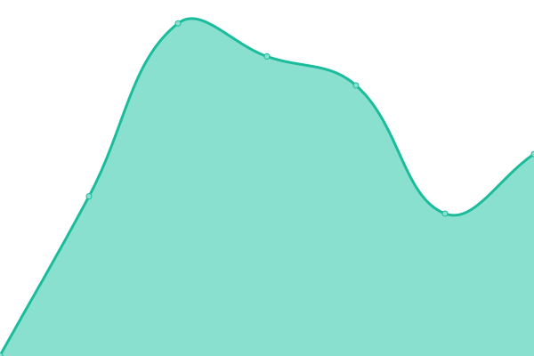

# [📈 Live Status](https://zaidajani.github.io/Monitor): <!--live status--> **🟧 Partial outage**

This repository contains the open-source uptime monitor and status page for [Zaid Sohel Ajani](https://perfactors.com/), powered by [Upptime](https://github.com/upptime/upptime).

With [Upptime](https://upptime.js.org), you can get your own unlimited and free uptime monitor and status page, powered entirely by a GitHub repository. We use [Issues](https://github.com/zaidajani/Monitor/issues) as incident reports, [Actions](https://github.com/zaidajani/Monitor/actions) as uptime monitors, and [Pages](https://zaidajani.github.io/Monitor) for the status page.

<!--start: status pages-->
<!-- This summary is generated by Upptime (https://github.com/upptime/upptime) -->
<!-- Do not edit this manually, your changes will be overwritten -->
<!-- prettier-ignore -->
| URL | Status | History | Response Time | Uptime |
| --- | ------ | ------- | ------------- | ------ |
|  [DaalPani website](https://daalpani.in/) | 🟥 Down | [daal-pani-website.yml](https://github.com/zaidajani/Monitor/commits/HEAD/history/daal-pani-website.yml) | 

 0ms
     
 | 

<a href="https://zaidajani.github.io/Monitor/history/daal-pani-website">100.00%</a>
    

|  [Qaumihaalat website](https://www.qaumihalaat.in/) | 🟩 Up | [qaumihaalat-website.yml](https://github.com/zaidajani/Monitor/commits/HEAD/history/qaumihaalat-website.yml) | 

 523ms
     
 | 

<a href="https://zaidajani.github.io/Monitor/history/qaumihaalat-website">100.00%</a>
    

|  [Covidnavimumbai](http://covidnavimumbai.in/) | 🟥 Down | [covidnavimumbai.yml](https://github.com/zaidajani/Monitor/commits/HEAD/history/covidnavimumbai.yml) | 

 0ms
     
 | 

<a href="https://zaidajani.github.io/Monitor/history/covidnavimumbai">100.00%</a>
    

<!--end: status pages-->

[**Visit our status website →**](https://zaidajani.github.io/Monitor)

## 📄 License

- Powered by: [Upptime](https://github.com/upptime/upptime)
- Code: [MIT](./LICENSE) © [Zaid Sohel Ajani](https://perfactors.com/)
- Data in the `./history` directory: [Open Database License](https://opendatacommons.org/licenses/odbl/1-0/)
